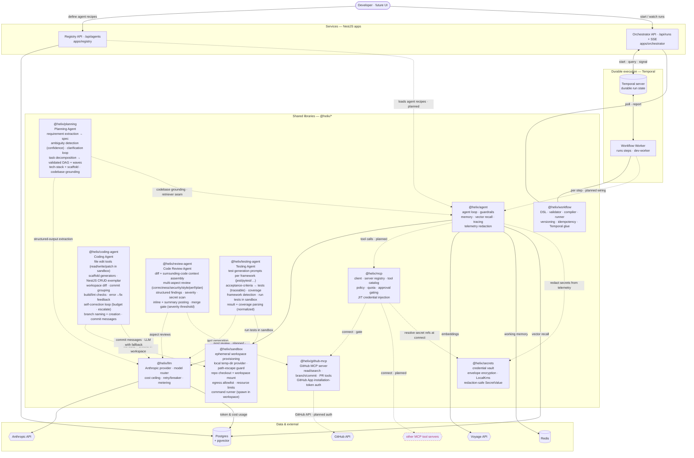
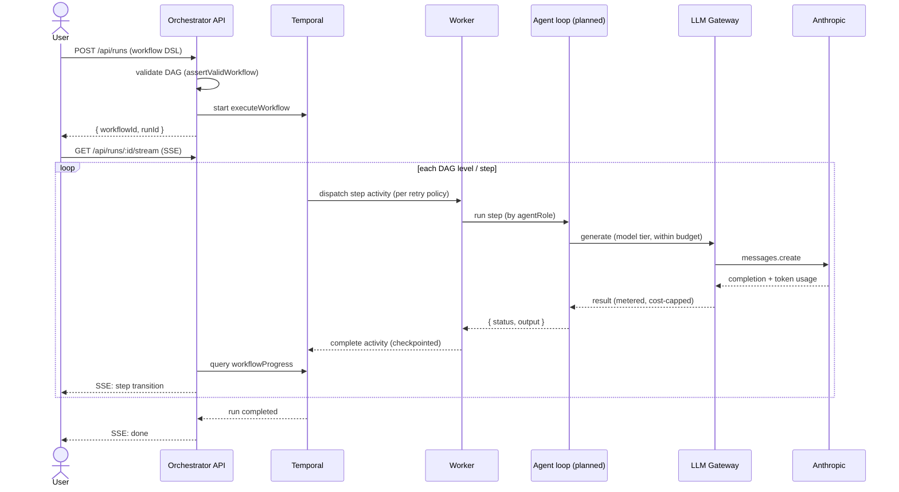

# Helix — architecture at a glance

What's been built so far and how the pieces connect and run in sync. Diagrams are
[Mermaid](https://mermaid.js.org/) — they render on GitHub and in VS Code's Mermaid
preview. For per-ticket detail see [DEVELOPMENT_LOG.md](DEVELOPMENT_LOG.md); to run it
locally see [LOCAL_TESTING.md](LOCAL_TESTING.md).

**Legend:** solid = built & merged · dashed = planned / not yet wired.

---

## 1. System architecture

How the apps, shared libraries, and external systems fit together.

**Reading it:**
- **Registry** is the catalog of *agent recipes* (system prompt, model policy, tools, guardrails), versioned in Postgres.
- **Orchestrator** is the run API: it validates a workflow, hands it to **Temporal**, and streams live per-step status back over SSE.
- **Temporal** holds the durable run state; the **Worker** is the stateless process that actually executes each step. Kill the worker and a new one resumes — state lives in Temporal.
- The **libraries** are the reusable brains: `@helix/workflow` (DAG engine), `@helix/agent` (the agent loop + memory + tracing), `@helix/llm` (the model gateway), `@helix/mcp` (tool access).
- **Dashed** edges are the next integrations: the worker currently runs a *stub* step executor; wiring it to the real agent loop — which in turn uses the LLM gateway, memory, and MCP tools — is the upcoming agent epics (HELIX-4..8) on top of MCP (HELIX-3).

---

## 2. A workflow run in motion

The "in sync" view: starting a run and watching it complete. (The agent loop step is the
planned wiring; today a stub executor stands in.)

**Human-in-the-loop:** a step can call `awaitApproval` — the run *durably pauses*, the
orchestrator surfaces an approval request, and a human decision (`submitApprovalDecision`)
resumes it. Idempotency keys ensure a retried step doesn't repeat side effects.

---

## 3. Build status

| Epic | Status | What it gives us |
|---|---|---|
| **HELIX-1 · Core Agent Platform** | ✅ done | Agent definitions + registry API; LLM gateway (routing, cost, resilience, metering); agent loop with guardrails, structured output, working memory, vector recall, tracing |
| **HELIX-2 · Workflow Engine** | ✅ done | Define → compile → run a DAG; durable execution on Temporal; human pause/resume; per-step retries; orchestrator run API + live SSE status |
| **HELIX-3 · MCP Integration Layer** | ✅ done | MCP client + server registry + tool catalog (HELIX-22); tool permissioning/quota/approval (HELIX-23); GitHub MCP server + App-token auth (HELIX-24); secrets vault — encrypted at rest, JIT injection, telemetry redaction (HELIX-25) |
| **HELIX-4 · Planning Agent** | ✅ done | NL request → validated requirements spec + clarification loop (HELIX-26); implementation plan — task graph, dependency ordering, tech-stack/scaffold (HELIX-27); codebase grounding (HELIX-28). The plan is the Coding Agent's input contract |
| **HELIX-5 · Coding Agent** | ✅ done | Isolated sandbox — provision, repo checkout, egress/limits, command runner (HELIX-29); file edit tools, scaffolding, diff + commit grouping (HELIX-30); build/lint runner, error→fix feedback, self-correction loop (HELIX-31); branch naming + commit messages (HELIX-32). Generates compiling, lint-passing changes on a branch |
| **HELIX-6 · Code Review Agent** | ✅ done | Diff-aware review engine — context assembly, multi-aspect review (correctness/security/style/perf/plan), structured findings + severity (HELIX-33); gitleaks-style secret scan (HELIX-34); inline + summary comment posting + a severity-threshold merge gate (HELIX-35). Reviews the Coding Agent's diffs and blocks or approves per policy |
| **HELIX-7 · Testing Agent** | 🛠️ in progress | Generate tests (per-framework), run them in the sandbox, report results/coverage, and loop failures back to the Coding Agent. Per-framework test-generation prompts landed (HELIX-117) |
| HELIX-8 · Deployment Agent | ⬜ | Replace the stub step executor with the deployment agent |
| HELIX-9 Approvals · HELIX-10 Monitoring · HELIX-11 SaaS | ⬜ | Human approval system, observability, and the user-facing UI |

---

## 4. Where each piece lives

| Component | Path |
|---|---|
| LLM gateway | [libs/llm](../libs/llm) (`@helix/llm`) |
| Agent runtime | [libs/agent](../libs/agent) (`@helix/agent`) |
| Workflow engine | [libs/workflow](../libs/workflow) (`@helix/workflow`, incl. `lib/temporal/`) |
| MCP integration | [libs/mcp](../libs/mcp) (`@helix/mcp`) |
| GitHub MCP server | [libs/github-mcp](../libs/github-mcp) (`@helix/github-mcp`) |
| Secrets vault | [libs/secrets](../libs/secrets) (`@helix/secrets`) |
| Planning Agent | [libs/planning](../libs/planning) (`@helix/planning`) |
| Sandbox | [libs/sandbox](../libs/sandbox) (`@helix/sandbox`) |
| Coding Agent | [libs/coding-agent](../libs/coding-agent) (`@helix/coding-agent`) |
| Code Review Agent | [libs/review-agent](../libs/review-agent) (`@helix/review-agent`) |
| Testing Agent | [libs/testing-agent](../libs/testing-agent) (`@helix/testing-agent`) |
| Registry service | [apps/registry](../apps/registry) |
| Orchestrator service | [apps/orchestrator](../apps/orchestrator) |
| Local worker (dev) | [libs/workflow/src/dev-worker.ts](../libs/workflow/src/dev-worker.ts) |
